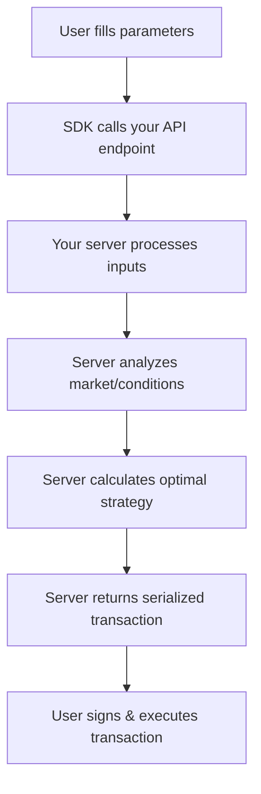

# Dynamic Actions

## The Most Powerful Action Type

Dynamic Actions are the **most sophisticated** action type in the Sherry SDK. They enable complex Web3 operations by leveraging server-side computation to determine the optimal transaction based on user inputs, market conditions, and complex business logic.

## Why Dynamic Actions?

Unlike Blockchain Actions where you call a specific contract function directly, Dynamic Actions let your server:

- 🧠 **Analyze market conditions** in real-time
- 🔄 **Calculate optimal routes** across multiple protocols
- 📊 **Process complex strategies** that require multiple steps
- 🎯 **Personalize transactions** based on user profile
- ⚡ **Adapt to changing conditions** before execution

## Interface

```typescript
interface DynamicAction {
  type: 'dynamic';
  label: string; // Button text shown to users
  description?: string; // Optional help text
  chains: ChainContext; // Source blockchain
  path: string; // Your API endpoint
  params?: Parameter[]; // User input parameters
}
```

## How It Works



## API Endpoint Requirements

Your endpoint must return an `ExecutionResponse`:

```typescript
interface ExecutionResponse {
  serializedTransaction: string; // Ready-to-execute transaction
  chainId: string; // Chain name (e.g., 'avalanche')
  abi?: any[]; // Optional: for verification
  params?: {
    // Optional: for better UX
    functionName: string;
    args: Record<string, any>;
  };
}
```

## Complete Example: Optimal DeFi Yield Strategy

### Frontend Configuration

```typescript
import { DynamicAction } from '@sherrylinks/sdk';

const optimalYieldAction: DynamicAction = {
  type: 'dynamic',
  label: 'Find Best Yield',
  description: 'AI-powered yield optimization across 15+ protocols',
  path: '/api/optimize-yield',
  chains: { source: 'avalanche' },
  params: [
    {
      name: 'amount',
      label: 'Investment Amount (USDC)',
      type: 'number',
      required: true,
      min: 100,
      max: 1000000,
      description: 'Minimum $100 for optimal routing',
    },
    {
      name: 'riskTolerance',
      label: 'Risk Tolerance',
      type: 'select',
      required: true,
      options: [
        {
          label: 'Conservative (3-5% APY)',
          value: 'low',
          description: 'Stable protocols only',
        },
        {
          label: 'Moderate (5-12% APY)',
          value: 'medium',
          description: 'Balanced risk/reward',
        },
        {
          label: 'Aggressive (12%+ APY)',
          value: 'high',
          description: 'Higher risk, higher reward',
        },
      ],
    },
    {
      name: 'duration',
      label: 'Investment Duration',
      type: 'radio',
      required: true,
      options: [
        { label: '1 week', value: 7 },
        { label: '1 month', value: 30 },
        { label: '3 months', value: 90 },
        { label: '1 year', value: 365 },
      ],
    },
    {
      name: 'autoCompound',
      label: 'Auto-compound rewards',
      type: 'boolean',
      value: true,
      description: 'Automatically reinvest rewards for compound growth',
    },
  ],
};
```

### Backend Implementation (Next.js API Route)

```typescript
// pages/api/optimize-yield.ts
import { NextRequest, NextResponse } from 'next/server';
import { serialize } from 'wagmi';
import { avalancheFuji } from 'viem/chains';

export async function POST(req: NextRequest) {
  try {
    // Get parameters from URL query
    const { searchParams } = new URL(req.url);
    const amount = parseFloat(searchParams.get('amount') || '0');
    const riskTolerance = searchParams.get('riskTolerance');
    const duration = parseInt(searchParams.get('duration') || '30');
    const autoCompound = searchParams.get('autoCompound') === 'true';

    // Validate inputs
    if (amount < 100) {
      return NextResponse.json({ error: 'Minimum investment is $100' }, { status: 400 });
    }

    // 🧠 COMPLEX SERVER-SIDE LOGIC STARTS HERE

    // 1. Fetch current yields from multiple protocols
    const protocolYields = await fetchProtocolYields([
      'AAVE',
      'Compound',
      'Yearn',
      'Convex',
      'Curve',
      'TraderJoe',
    ]);

    // 2. Filter by risk tolerance
    const filteredProtocols = filterByRisk(protocolYields, riskTolerance);

    // 3. Calculate optimal allocation
    const optimalAllocation = calculateOptimalAllocation(
      filteredProtocols,
      amount,
      duration,
      autoCompound,
    );

    // 4. Determine best execution strategy
    const strategy = await planExecutionStrategy(optimalAllocation);

    // 5. Build the optimal transaction
    const transaction = await buildOptimalTransaction(strategy, {
      amount,
      userAddress: req.headers.get('x-wallet-address'),
      slippageTolerance: 0.5, // 0.5%
    });

    // 6. Serialize the transaction
    const serializedTx = serialize({
      to: transaction.to,
      data: transaction.data,
      value: BigInt(transaction.value || 0),
      chainId: avalancheFuji.id,
    });

    // 7. Return the response
    const response: ExecutionResponse = {
      serializedTransaction: serializedTx,
      chainId: 'fuji',
      abi: strategy.contractAbi,
      params: {
        functionName: strategy.functionName,
        args: {
          amount: amount.toString(),
          strategy: strategy.name,
          expectedAPY: `${strategy.projectedAPY}%`,
          protocols: strategy.protocols.map(p => p.name),
        },
      },
    };

    return NextResponse.json(response, {
      headers: {
        'Access-Control-Allow-Origin': '*',
        'Access-Control-Allow-Methods': 'POST',
      },
    });
  } catch (error) {
    console.error('Yield optimization error:', error);
    return NextResponse.json({ error: 'Failed to optimize yield strategy' }, { status: 500 });
  }
}

// Helper functions for complex logic
async function fetchProtocolYields(protocols: string[]) {
  // Fetch real-time APY data from multiple DeFi protocols
  const yields = await Promise.all(
    protocols.map(async protocol => {
      const response = await fetch(`https://api.${protocol.toLowerCase()}.com/yields`);
      return response.json();
    }),
  );
  return yields;
}

function filterByRisk(yields: any[], riskTolerance: string) {
  switch (riskTolerance) {
    case 'low':
      return yields.filter(y => y.riskScore <= 3 && y.apy >= 3);
    case 'medium':
      return yields.filter(y => y.riskScore <= 6 && y.apy >= 5);
    case 'high':
      return yields.filter(y => y.apy >= 12);
    default:
      return yields;
  }
}

function calculateOptimalAllocation(
  protocols: any[],
  amount: number,
  duration: number,
  autoCompound: boolean,
) {
  // Complex portfolio optimization algorithm
  // Consider correlation, expected returns, volatility, etc.

  const allocation = portfolioOptimizer.optimize({
    protocols,
    totalAmount: amount,
    timeHorizon: duration,
    autoCompound,
    objective: 'maximize_sharpe_ratio',
  });

  return allocation;
}

async function planExecutionStrategy(allocation: any) {
  // Determine the most gas-efficient way to execute the allocation
  // Could involve batch transactions, optimal ordering, etc.

  return {
    contractAddress: '0xOptimalYieldManager...',
    functionName: 'executeOptimalStrategy',
    contractAbi: optimizerAbi,
    data: encodeStrategyData(allocation),
    protocols: allocation.protocols,
    projectedAPY: allocation.expectedReturn,
    name: allocation.strategyName,
  };
}

async function buildOptimalTransaction(strategy: any, config: any) {
  // Build the final transaction data
  return {
    to: strategy.contractAddress,
    data: strategy.data,
    value: config.amount,
  };
}
```

## Advanced Use Cases

### 1. **Multi-Protocol Arbitrage**

```typescript
const arbitrageAction: DynamicAction = {
  type: 'dynamic',
  label: 'Execute Arbitrage',
  path: '/api/find-arbitrage',
  chains: { source: 'avalanche' },
  params: [
    {
      name: 'token',
      label: 'Token to Arbitrage',
      type: 'select',
      options: [
        { label: 'USDC', value: 'usdc' },
        { label: 'USDT', value: 'usdt' },
        { label: 'DAI', value: 'dai' },
      ],
    },
    {
      name: 'maxSlippage',
      label: 'Max Slippage (%)',
      type: 'number',
      value: 0.5,
      min: 0.1,
      max: 5,
    },
  ],
};
```

**Server Logic:**

- Scans 10+ DEXs for price differences
- Calculates optimal route considering gas costs
- Executes flash loan arbitrage if profitable
- Returns single transaction that captures profit

### 2. **Dynamic NFT Pricing**

```typescript
const dynamicMintAction: DynamicAction = {
  type: 'dynamic',
  label: 'Mint at Current Price',
  path: '/api/nft-current-price',
  chains: { source: 'avalanche' },
  params: [
    {
      name: 'tier',
      label: 'NFT Tier',
      type: 'select',
      options: [
        { label: 'Common', value: 'common' },
        { label: 'Rare', value: 'rare' },
        { label: 'Legendary', value: 'legendary' },
      ],
    },
  ],
};
```

**Server Logic:**

- Analyzes current market conditions
- Adjusts price based on demand/supply
- Considers whale wallet activity
- Sets optimal mint price dynamically

### 3. **Cross-Chain Optimization**

```typescript
const crossChainAction: DynamicAction = {
  type: 'dynamic',
  label: 'Optimal Cross-Chain Swap',
  path: '/api/cross-chain-optimize',
  chains: { source: 'avalanche', destination: 'celo' },
  params: [
    {
      name: 'fromToken',
      label: 'From Token',
      type: 'select',
      options: [
        /* tokens on Avalanche */
      ],
    },
    {
      name: 'toToken',
      label: 'To Token',
      type: 'select',
      options: [
        /* tokens on Celo */
      ],
    },
    {
      name: 'amount',
      label: 'Amount',
      type: 'number',
      required: true,
    },
  ],
};
```

**Server Logic:**

- Compares direct bridge vs multi-hop routes
- Considers bridge fees, slippage, time
- Finds optimal path across chains
- Executes complex cross-chain transaction

## Parameter Processing

Dynamic Actions receive parameters as URL query parameters:

```typescript
// Frontend config
params: [
  { name: 'amount', label: 'Amount', type: 'number' },
  { name: 'strategy', label: 'Strategy', type: 'select', options: [...] }
]

// Your API receives:
// POST /api/your-endpoint?amount=1000&strategy=aggressive&userAddress=0x...
```

### Accessing Parameters

```typescript
export async function POST(req: NextRequest) {
  const { searchParams } = new URL(req.url);

  // Get user inputs
  const amount = parseFloat(searchParams.get('amount') || '0');
  const strategy = searchParams.get('strategy');

  // Get additional context
  const userAddress = searchParams.get('userAddress');
  const chainId = searchParams.get('chain');

  // Your logic here...
}
```

## Error Handling

Handle errors gracefully in your Dynamic Actions:

```typescript
export async function POST(req: NextRequest) {
  try {
    // Your logic
    return NextResponse.json(response);
  } catch (error) {
    console.error('Dynamic action error:', error);

    // Return user-friendly error
    return NextResponse.json(
      {
        error: 'Unable to calculate optimal strategy. Please try again.',
        details: process.env.NODE_ENV === 'development' ? error.message : undefined,
      },
      { status: 500 },
    );
  }
}
```

## Best Practices

### 1. **Validate Inputs**

```typescript
// Always validate user inputs
if (amount < minimumAmount) {
  return NextResponse.json({ error: 'Amount too low' }, { status: 400 });
}
```

### 2. **Handle Rate Limits**

```typescript
// Implement rate limiting for expensive calculations
const rateLimiter = new RateLimit({
  windowMs: 60 * 1000, // 1 minute
  max: 10, // 10 requests per minute
});
```

### 3. **Cache When Possible**

```typescript
// Cache expensive calculations
const cacheKey = `strategy-${amount}-${risk}-${duration}`;
const cached = await redis.get(cacheKey);
if (cached) {
  return NextResponse.json(JSON.parse(cached));
}
```

### 4. **Provide Rich Feedback**

```typescript
// Include useful info in the response
params: {
  functionName: 'executeStrategy',
  args: {
    expectedAPY: '12.5%',
    protocols: ['Aave', 'Compound'],
    riskLevel: 'Medium',
    projectedValue: '$1,125 after 1 year'
  }
}
```

### 5. **Security Considerations**

```typescript
// Validate user address if needed
const userAddress = req.headers.get('x-wallet-address');
if (!isValidAddress(userAddress)) {
  return NextResponse.json({ error: 'Invalid wallet' }, { status: 401 });
}

// Sanitize inputs
const sanitizedAmount = Math.max(0, Math.min(amount, MAX_AMOUNT));
```

## When to Use Dynamic Actions

### ✅ **Perfect for:**

- Multi-protocol yield optimization
- Real-time price calculations
- Complex arbitrage opportunities
- Cross-chain route optimization
- AI-powered trading strategies
- Market-dependent decisions
- Multi-step transaction planning

### ❌ **Overkill for:**

- Simple token transfers (use Transfer Actions)
- Fixed-price NFT minting (use Blockchain Actions)
- Static contract calls (use Blockchain Actions)
- Simple approve/transfer flows

## Deployment Considerations

### Production Checklist:

- [ ] **Performance**: API responds in ${'<2'} seconds
- [ ] **Error Handling**: Graceful error messages
- [ ] **Rate Limiting**: Prevent abuse
- [ ] **Monitoring**: Log important events
- [ ] **Caching**: Cache expensive calculations
- [ ] **Security**: Validate all inputs
- [ ] **Testing**: Test with various scenarios

---

## Next Steps

- [**Blockchain Actions**](./blockchain-actions) - When direct contract calls are sufficient
- [**Transfer Actions**](./transfer-actions) - For simple native token transfers
- [**Action Flows**](./action-flows) - Combine Dynamic Actions in multi-step workflows
- [**Parameters Guide**](../parameters/parameters) - Master parameter configuration
