# 🔌 TriggerKit Browser Extension Integration

Build powerful browser extensions that automatically detect and enhance links with interactive blockchain MiniApps on Twitter/X, YouTube, and Twitch.

import Tabs from '@theme/Tabs';
import TabItem from '@theme/TabItem';
import CodeBlock from '@theme/CodeBlock';

:::warning ⚠️ Beta Notice
TriggerKit is currently in active development. Some APIs and configurations may change in future releases as we refine the extension integration experience.
:::

## ⚡ Quick Start

<Tabs>
<TabItem value="npm" label="📦 npm">

```bash
npm install @sherrylabs/trigger-kit @sherrylabs/trigger-nucleo
```

</TabItem>
<TabItem value="yarn" label="🧶 Yarn">

```bash
yarn add @sherrylabs/trigger-kit @sherrylabs/trigger-nucleo
```

</TabItem>
<TabItem value="pnpm" label="🏃 pnpm">

```bash
pnpm add @sherrylabs/trigger-kit @sherrylabs/trigger-nucleo
```

</TabItem>
</Tabs>

---

## 🏗️ Extension Architecture Overview

A complete TriggerKit extension consists of several key components:

```mermaid
graph TB
    A[📄 Content Script] --> B[🔧 Background Script]
    B --> C[💳 Wallet Communication]
    A --> D[👁️ DOM Observer]
    D --> E[🚀 MiniApp Injection]
    F[⚙️ Popup Interface] --> B
    G[📋 Manifest Config] --> A
    G --> B
    G --> F
```



### 🧩 Core Components

| Component                | Purpose          | Responsibilities                           |
| ------------------------ | ---------------- | ------------------------------------------ |
| **🔧 Background Script** | Service worker   | Wallet communication, transaction handling |
| **📄 Content Script**    | Page injection   | DOM observation, MiniApp injection         |
| **⚙️ Popup Interface**   | User settings    | Wallet configuration, preferences          |
| **📋 Manifest**          | Extension config | Permissions, script registration           |

---

## 📁 Project Structure

```
my-triggerkit-extension/
├── 📁 public/
│   ├── manifest.json
│   └── 📁 icons/
│       ├── icon-16.png
│       ├── icon-32.png
│       ├── icon-48.png
│       └── icon-128.png
├── 📁 src/
│   ├── 📁 background/
│   │   └── background.ts
│   ├── 📁 content/
│   │   └── content.ts
│   ├── 📁 popup/
│   │   ├── index.html
│   │   ├── index.tsx
│   │   └── 📁 components/
│   └── 📁 shared/
│       ├── types.ts
│       └── utils.ts
├── 📁 dist/
└── package.json
```

---

## ⚙️ Manifest Configuration

### 📋 Manifest V3 Setup

```json title="public/manifest.json"
{
  "manifest_version": 3,
  "name": "TriggerKit Extension",
  "version": "1.0.0",
  "description": "Enhance web links with interactive blockchain MiniApps",

  "permissions": ["storage", "activeTab", "scripting"],

  "host_permissions": [
    "https://twitter.com/*",
    "https://x.com/*",
    "https://pro.x.com/*",
    "https://www.youtube.com/*",
    "https://*.twitch.tv/*",
    "https://api.sherry.social/*"
  ],

  "background": {
    "service_worker": "background.js",
    "type": "module"
  },

  "content_scripts": [
    {
      "matches": [
        "https://twitter.com/*",
        "https://x.com/*",
        "https://pro.x.com/*",
        "https://www.youtube.com/*",
        "https://*.twitch.tv/*"
      ],
      "js": ["content.js"],
      "run_at": "document_idle",
      "all_frames": false
    }
  ],

  "action": {
    "default_popup": "popup.html",
    "default_title": "TriggerKit Settings",
    "default_icon": {
      "16": "icons/icon-16.png",
      "32": "icons/icon-32.png",
      "48": "icons/icon-48.png",
      "128": "icons/icon-128.png"
    }
  },

  "web_accessible_resources": [
    {
      "resources": ["icons/*", "assets/*"],
      "matches": [
        "https://twitter.com/*",
        "https://x.com/*",
        "https://pro.x.com/*",
        "https://www.youtube.com/*",
        "https://*.twitch.tv/*"
      ]
    }
  ],

  "icons": {
    "16": "icons/icon-16.png",
    "32": "icons/icon-32.png",
    "48": "icons/icon-48.png",
    "128": "icons/icon-128.png"
  }
}
```

---

## 🔧 Background Script Implementation

### 🧠 Core Background Service

```typescript title="src/background/background.ts"
import { encodeFunctionData, createPublicClient, http } from 'viem';
import { avalanche, avalancheFuji, monadTestnet, celo, celoAlfajores } from 'viem/chains';

// 🌐 Supported blockchain networks
const chainMap: Record<number, any> = {
  43114: avalanche,
  43113: avalancheFuji,
  10143: monadTestnet,
  42220: celo,
  44787: celoAlfajores,
};

// ...existing code...

// 📨 Main message handler
chrome.runtime.onMessage.addListener((message: ExtensionMessage, sender, sendResponse) => {
  console.log('[Background] 📨 Received message:', message.type);

  const tabId = sender.tab?.id;
  if (!tabId) {
    console.warn('[Background] ⚠️ No tab ID available');
    sendResponse({ error: 'No tab ID available' });
    return false;
  }

  // Handle wallet selection queries
  if (message.type === 'getSelectedWallet') {
    chrome.storage.local.get(['selectedWallet']).then(storage => {
      sendResponse(storage.selectedWallet || null);
    });
    return true; // Keep sendResponse alive
  }

  // Handle wallet communication
  if (message.wallet && message.type) {
    handleWalletCommunication(message.type, message.wallet, tabId, message.payload)
      .then(result => sendResponse(result))
      .catch(error => {
        console.error('[Background] ❌ Error:', error);
        sendResponse({ error: error.message });
      });
    return true; // Keep sendResponse alive
  }

  return false;
});

// ...existing code...
```

### 💳 Wallet Operations

```typescript title="src/background/wallet-operations.ts"
// 🔗 Connect to MetaMask wallet
async function connectWallet(tabId: number) {
  const [result] = await chrome.scripting.executeScript({
    target: { tabId },
    world: 'MAIN',
    func: async () => {
      if (!window.ethereum) {
        return { error: 'MetaMask not found' };
      }

      try {
        const accounts = await window.ethereum.request({
          method: 'eth_requestAccounts',
        });
        return { address: accounts?.[0] ?? null };
      } catch (error: any) {
        return { error: error.message ?? 'Connection failed' };
      }
    },
  });

  return result?.result ?? { error: 'No result from connect operation' };
}

// ...existing code...

// 📝 Write to smart contract
async function writeContract(tabId: number, payload: any) {
  const { address, abi, functionName, args, value, data: providedData } = payload;

  try {
    // Encode function data if not provided
    const encodedData =
      providedData ??
      encodeFunctionData({
        abi: typeof abi === 'string' ? JSON.parse(abi) : abi,
        functionName,
        args,
      });

    // ...existing code...
  } catch (error: any) {
    return { error: error?.message ?? 'Unexpected error in write contract' };
  }
}

// ...existing code...
```

---

## 📄 Content Script Implementation

### 🚀 Main Content Script

```typescript title="src/content/content.ts"
import '@sherrylabs/slinks/index.css';
import { SherryExtensionAdapter, setupSlinksObserverEVM } from '@sherrylabs/slinks/ext';
import { setClientKey, MiniAppDirectory } from '@sherrylabs/slinks-core';

// 🔄 Initialize the TriggerKit observer system
export async function initializeTriggerKit() {
  console.log('[TriggerKit] 🚀 Initializing extension...');

  // ...existing code...

  // Initialize MiniApp directory
  const directory = MiniAppDirectory.getInstance();
  try {
    await directory.init({
      refreshInterval: 60 * 60 * 1000, // 1 hour
      retryAttempts: 3,
      retryDelay: 5000,
    });
    console.log('[TriggerKit] ✅ MiniApp Directory initialized');
  } catch (error) {
    console.error('[TriggerKit] ❌ Failed to initialize directory:', error);
    return;
  }

  // ...existing code...

  // Create adapter and start observing
  const adapter = new SherryExtensionAdapter();

  // Auto-detect platform and setup appropriate observer
  setupSlinksObserverEVM(adapter, {
    enableTwitter: true,
    enableYouTube: true,
    enableTwitch: true,
    debugMode: process.env.NODE_ENV === 'development',
  });

  console.log('[TriggerKit] 🔍 Observers started successfully');
}

// ...existing code...
```

### 🎯 Platform-Specific Observers

<Tabs>
<TabItem value="auto" label="🤖 Automatic Detection">

```typescript
import { setupSlinksObserverEVM } from '@sherrylabs/slinks/ext';

// Automatically detects platform and sets up appropriate observer
setupSlinksObserverEVM(adapter, {
  enableTwitter: true,
  enableYouTube: true,
  enableTwitch: true,
  observerOptions: {
    debounceMs: 500,
    maxRetries: 3,
    enableDeepObservation: true,
  },
});
```

</TabItem>
<TabItem value="twitter" label="🐦 Twitter/X Only">

```typescript
import { setupTwitterObserverEVM } from '@sherrylabs/slinks/ext';

// Twitter-specific observer for tweet link cards
setupTwitterObserverEVM(adapter, {
  observeNewTweets: true,
  observeReplies: true,
  observeQuoteTweets: true,
  debounceMs: 300,
});
```

</TabItem>
<TabItem value="youtube" label="📺 YouTube Only">

```typescript
import { setupYoutubeObserverEVM } from '@sherrylabs/slinks/ext';

// YouTube-specific observer for video descriptions
setupYoutubeObserverEVM(adapter, {
  observeDescriptions: true,
  observeComments: false, // Optional: observe comments
  observePinnedComments: true,
});
```

</TabItem>
<TabItem value="twitch" label="🎮 Twitch Only">

```typescript
import { setupTwitchObserverEVM } from '@sherrylabs/slinks/ext';

// Twitch-specific observer for chat messages
setupTwitchObserverEVM(adapter, {
  observePinnedMessages: true,
  observeChatCommands: true,
  observeChannelInfo: true,
});
```

</TabItem>
</Tabs>

---

## 🔌 Extension Adapter Implementation

The `SherryExtensionAdapter` bridges the gap between MiniApps and browser extension APIs:

```typescript title="src/shared/adapter.ts"
import { SherryExtensionAdapter } from '@sherrylabs/slinks/ext';

// Usage example - adapter is already implemented in the library
const adapter = new SherryExtensionAdapter();

// 🔗 Connect wallet
try {
  const result = await adapter.connect();
  if (result.address) {
    console.log('✅ Connected to:', result.address);
  }
} catch (error) {
  console.error('❌ Connection failed:', error);
}

// 📝 Execute smart contract transaction
try {
  const txResult = await adapter.writeContract({
    address: '0x742d35Cc6438C0532925a3b762c7C46f83D8FA67',
    abi: [...],
    functionName: 'transfer',
    args: ['0x...', BigInt('1000000000000000000')],
    value: BigInt(0)
  });
  console.log('🎉 Transaction hash:', txResult.txHash);
} catch (error) {
  console.error('❌ Transaction failed:', error);
}

// ...existing code...
```

---

## 🔧 Popup Interface

### 📄 Popup HTML Structure

```html title="src/popup/index.html"
<!DOCTYPE html>
<html lang="en">
  <head>
    <meta charset="UTF-8" />
    <meta name="viewport" content="width=device-width, initial-scale=1.0" />
    <title>TriggerKit Settings</title>
    <style>
      body {
        width: 320px;
        min-height: 400px;
        margin: 0;
        font-family: -apple-system, BlinkMacSystemFont, 'Segoe UI', sans-serif;
      }
    </style>
  </head>
  <body>
    <div id="popup-root"></div>
    <script src="popup.js"></script>
  </body>
</html>
```

### ⚛️ React Popup Component

```tsx title="src/popup/components/PopupApp.tsx"
import React, { useState, useEffect } from 'react';
import { WalletSelector } from './WalletSelector';
import { Settings } from './Settings';
import { About } from './About';

type Tab = 'wallet' | 'settings' | 'about';

export function PopupApp() {
  const [activeTab, setActiveTab] = useState<Tab>('wallet');
  const [selectedWallet, setSelectedWallet] = useState<string | null>(null);

  // ...existing code...

  return (
    <div className="min-h-[400px] bg-white">
      {/* 🎨 Header */}
      <div className="bg-gradient-to-r from-blue-600 to-purple-600 text-white p-4">
        <div className="flex items-center space-x-2">
          
          <h1 className="text-lg font-semibold">TriggerKit</h1>
        </div>
        <p className="text-blue-100 text-sm mt-1">🚀 Blockchain MiniApps</p>
      </div>

      {/* 📑 Tab Navigation */}
      <div className="flex border-b">
        {[
          { id: 'wallet', label: '👛 Wallet', title: 'Wallet' },
          { id: 'settings', label: '⚙️ Settings', title: 'Settings' },
          { id: 'about', label: 'ℹ️ About', title: 'About' },
        ].map(tab => (
          <button
            key={tab.id}
            onClick={() => setActiveTab(tab.id as Tab)}
            className={`flex-1 py-3 px-4 text-sm font-medium transition-colors ${
              activeTab === tab.id
                ? 'text-blue-600 border-b-2 border-blue-600 bg-blue-50'
                : 'text-gray-600 hover:text-gray-800 hover:bg-gray-50'
            }`}
            title={tab.title}
          >
            {tab.label}
          </button>
        ))}
      </div>

      {/* 📋 Tab Content */}
      <div className="p-4">{/* ...existing code... */}</div>
    </div>
  );
}
```

### 👛 Wallet Selector Component

```tsx title="src/popup/components/WalletSelector.tsx"
import React from 'react';

interface WalletOption {
  id: string;
  name: string;
  icon: string;
  description: string;
  available: boolean;
}

const wallets: WalletOption[] = [
  {
    id: 'metamask',
    name: 'MetaMask',
    icon: '/icons/metamask.png',
    description: '🦊 Connect using MetaMask wallet',
    available: true,
  },
  {
    id: 'core',
    name: 'Core Wallet',
    icon: '/icons/core.svg',
    description: '🔥 Connect using Core wallet',
    available: false, // Coming soon
  },
];

interface WalletSelectorProps {
  selectedWallet: string | null;
  onWalletSelect: (wallet: string) => void;
}

export function WalletSelector({ selectedWallet, onWalletSelect }: WalletSelectorProps) {
  return (
    <div>
      <h3 className="text-lg font-semibold mb-4">👛 Select Wallet</h3>

      <div className="space-y-3">{/* ...existing code... */}</div>

      {selectedWallet && (
        <div className="mt-6 p-4 bg-green-50 border border-green-200 rounded-lg">
          <div className="flex items-center space-x-2">
            <svg className="w-5 h-5 text-green-600" fill="currentColor" viewBox="0 0 20 20">
              <path
                fillRule="evenodd"
                d="M10 18a8 8 0 100-16 8 8 0 000 16zm3.707-9.293a1 1 0 00-1.414-1.414L9 10.586 7.707 9.293a1 1 0 00-1.414 1.414l2 2a1 1 0 001.414 0l4-4z"
                clipRule="evenodd"
              />
            </svg>
            <span className="text-green-800 font-medium">✅ Wallet Connected</span>
          </div>
          <p className="text-green-700 text-sm mt-1">
            🎉 TriggerKit is now active on supported websites
          </p>
        </div>
      )}
    </div>
  );
}
```

---

## 🏗️ Build Configuration

### 📦 Webpack Setup

```javascript title="webpack.config.js"
const path = require('path');
const CopyPlugin = require('copy-webpack-plugin');

module.exports = {
  mode: 'production',
  entry: {
    background: './src/background/background.ts',
    content: './src/content/content.ts',
    popup: './src/popup/index.tsx',
  },
  output: {
    path: path.resolve(__dirname, 'dist'),
    filename: '[name].js',
    clean: true,
  },
  // ...existing code...
};
```

### 📜 Package.json Scripts

```json title="package.json"
{
  "name": "triggerkit-extension",
  "version": "1.0.0",
  "scripts": {
    "build": "webpack --mode=production",
    "dev": "webpack --mode=development --watch",
    "clean": "rimraf dist",
    "lint": "eslint src --ext .ts,.tsx",
    "test": "jest"
  }
  // ...existing code...
}
```

---

## 🛠️ Development Workflow

### 🚀 Local Development

<Tabs>
<TabItem value="setup" label="⚙️ Setup">

```bash
# Clone and setup
git clone <your-extension-repo>
cd triggerkit-extension
npm install

# Set environment variables
echo "VITE_SHERRY_CLIENT_KEY=your_key_here" > .env

# Build extension
npm run build
```

</TabItem>
<TabItem value="testing" label="🧪 Testing">

```bash
# Development build with watch
npm run dev

# Load extension in Chrome:
# 1. Open chrome://extensions/
# 2. Enable "Developer mode"
# 3. Click "Load unpacked"
# 4. Select the 'dist' folder
```

</TabItem>
<TabItem value="debugging" label="🐛 Debugging">

```bash
# View logs in Chrome DevTools:
# - Background script: chrome://extensions/ → Inspect views
# - Content script: F12 on website → Console
# - Popup: Right-click extension icon → Inspect popup
```

</TabItem>
</Tabs>

### 🌐 Testing on Different Platforms

| Platform         | Test URLs                              | Key Features                 |
| ---------------- | -------------------------------------- | ---------------------------- |
| **🐦 Twitter/X** | `https://twitter.com`, `https://x.com` | Tweet link cards, replies    |
| **📺 YouTube**   | `https://youtube.com`                  | Video descriptions, comments |
| **🎮 Twitch**    | `https://twitch.tv`                    | Chat pinned messages         |

---

## 🔒 Security Best Practices

### 🛡️ Content Security Policy

```json title="manifest.json"
{
  "content_security_policy": {
    "extension_pages": "script-src 'self'; object-src 'self'"
  }
}
```

### 🔐 Safe DOM Manipulation

```typescript
// ✅ Safe: Use extension APIs
chrome.scripting.executeScript({
  target: { tabId },
  world: 'MAIN',
  func: () => {
    /* safe code */
  },
});

// ❌ Unsafe: Direct DOM injection
document.body.innerHTML = userContent;

// ✅ Safe: Sanitize content
const safeElement = document.createElement('div');
safeElement.textContent = userContent;
```

---

## 🐛 Troubleshooting

### Common Issues

<details>
<summary><strong>❌ Extension not loading</strong></summary>

1. Check manifest.json syntax
2. Verify all file paths exist
3. Check Chrome DevTools Console for errors
4. Ensure proper permissions are set

```bash
# Validate manifest
jsonlint public/manifest.json

# Check build output
ls -la dist/
```

</details>

<details>
<summary><strong>📄 Content script not injecting</strong></summary>

1. Verify host_permissions in manifest
2. Check URL patterns match exactly
3. Ensure run_at timing is correct
4. Check for CSP blocks

```javascript
// Debug content script injection
console.log('[Content] 📄 Script loaded on:', window.location.href);
```

</details>

<details>
<summary><strong>📨 Background script communication failing</strong></summary>

1. Check service worker is registered
2. Verify message passing syntax
3. Check for async/await issues
4. Ensure sendResponse is called

```javascript
// Debug message passing
chrome.runtime.onMessage.addListener((msg, sender, sendResponse) => {
  console.log('[Background] 📨 Message received:', msg);
  sendResponse({ status: 'received' });
  return true; // Keep sendResponse alive
});
```

</details>

<details>
<summary><strong>🚀 MiniApps not appearing</strong></summary>

1. Check TriggerKit initialization
2. Verify wallet is selected
3. Check MiniApp Directory status
4. Verify DOM observers are running

```javascript
// Debug observer status
console.log('[TriggerKit] 👁️ Observers active:', {
  twitter: !!window.twitterObserver,
  youtube: !!window.youtubeObserver,
  twitch: !!window.twitchObserver,
});
```

</details>

---

## ⚡ Performance Optimization

### 👁️ Efficient DOM Observation

```typescript
// Use IntersectionObserver for performance
const observer = new IntersectionObserver(
  entries => {
    entries.forEach(entry => {
      if (entry.isIntersecting) {
        // Only process visible elements
        processLinkForMiniApps(entry.target);
      }
    });
  },
  {
    rootMargin: '100px', // Pre-load slightly outside viewport
  },
);

// Debounce rapid changes
const debouncedProcessing = debounce(processNewLinks, 300);
```

### 🧠 Memory Management

```typescript
// Clean up observers when navigating away
window.addEventListener('beforeunload', () => {
  observers.forEach(observer => observer.disconnect());
  clearInterval(refreshInterval);
});

// Use WeakMap for element associations
const elementMetadata = new WeakMap();
```

---

## 📦 Publishing & Distribution

### 🏪 Chrome Web Store

1. **🎨 Prepare Assets**

   - Extension icons (16, 32, 48, 128px)
   - Screenshots for store listing
   - Privacy policy and terms

2. **📝 Store Listing**
   ```json
   {
     "name": "TriggerKit - Blockchain MiniApps",
     "short_description": "Transform web links into interactive blockchain experiences",
     "category": "Productivity",
     "keywords": ["blockchain", "defi", "web3", "crypto"]
   }
   ```

---

## 🤝 Resources & Support

<div className="grid grid-cols-1 md:grid-cols-2 gap-4 mt-6">
  <div className="border rounded-lg p-4">
    <h3 className="font-semibold mb-2">🛠 Extension APIs</h3>
    <p className="text-sm text-gray-600">
      <a
        href="https://developer.chrome.com/docs/extensions/"
        className="text-blue-600 hover:underline"
      >
        Chrome Extension Documentation
      </a>
    </p>
  </div>

<div className="border rounded-lg p-4">
  <h3 className="font-semibold mb-2">📚 TriggerKit Docs</h3>
  <p className="text-sm text-gray-600">Complete SDK reference and guides</p>
</div>

<div className="border rounded-lg p-4">
  <h3 className="font-semibold mb-2">💬 Developer Community</h3>
  <p className="text-sm text-gray-600">
    <a href="https://discord.com/invite/sherry" className="text-blue-600 hover:underline">
      Join our Discord
    </a>
  </p>
</div>

  <div className="border rounded-lg p-4">
    <h3 className="font-semibold mb-2">🐛 Bug Reports</h3>
    <p className="text-sm text-gray-600">
      <a
        href="https://github.com/orgs/SherryLabs/repositories"
        className="text-blue-600 hover:underline"
      >
        GitHub Issues
      </a>
    </p>
  </div>
</div>
